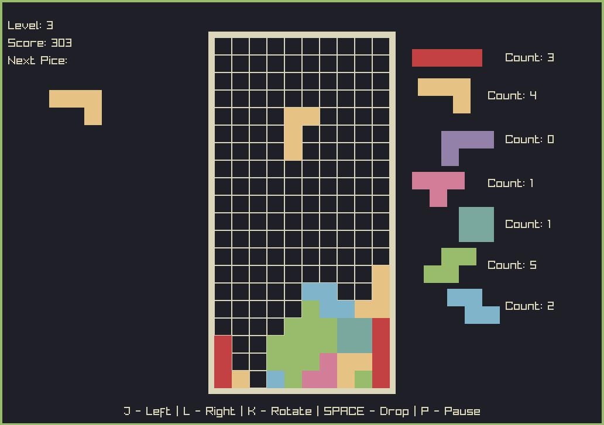

# gforth-tetris

tetris using my own FORTH implementation
[ex:forth](https://github.com/De-Alchmst/ex-forth) and
[raylib](https://www.raylib.com/)

inspred by [tint](https://github.com/DavidGriffith/tint.git),
based on older
[gforth implementation](https://github.com/De-Alchmst/gforth-tetris)

# setup
You will need to have raylib (made with vesion 5.5) and ex:forth installed.
Raylib needs to be in the form of shared library.

To start the program, simply run `exforth main.4th`.

# score
- upon pice landing, add 1 to score
- add additional 1 for every line dropped
- if show next enabled, divide by two (and add 1 to make up for one lost by
        division rounding)
- multiply by current level

# levels
- there is 9 levels
- block falls each 1/level seconds
- level increses each 10 lines
- first increas takes 10*level lines

# themes used
- [Kanagawa](https://github.com/rebelot/kanagawa.nvim)
- [Gruvbox Light](https://github.com/morhetz/gruvbox)
